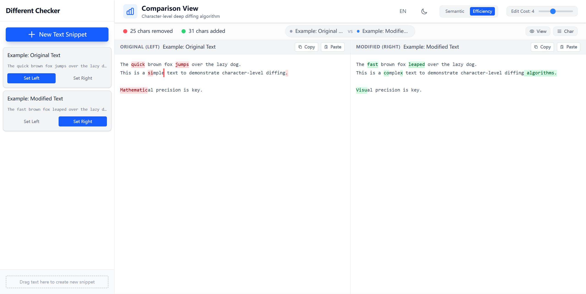

# Precision Diff Checker
[中文 Readme](./README.zh.md)

A **high‑performance, visual diff tool** for comparing code snippets, text files, or any string data. It highlights insertions, deletions, and modifications in an intuitive UI.

## 📸 Screenshots



## ✨ Features

- **Customizable diff algorithms** – switch between semantic and efficiency modes.
- **Light / Dark themes** – automatic theme detection with manual toggle.
- **Adjustable edit cost** – fine‑tune sensitivity for changes.
- **Real‑time editing** – Responsive diff computation with smart queuing method.
- **Multiple snippet support** – create any number of text snippets and compare any two of them.
- **Enhanced drag & drop** – Drop text anywhere in the sidebar or panels to create snippets instantly.
- **Smart snippet naming** – Automatically names snippets based on creation method with auto-incrementing counters:
  - **Untitled Text** (created via "New Snippet" button)
  - **Dropped Text** (created by dragging text)
  - **Pasted Text** (created by pasting)
- **Bilingual interface** – Full support for English and Chinese with quick language switching.
- **Flexible content management**:
  - Paste into empty panels to create new snippets
  - Copy panel content with Ctrl+C
  - Paste into panels with Ctrl+V or Paste button
  - Visual feedback for all drag-drop operations


## 🚀 Getting Started

### Prerequisites

- Node.js (>= 18)
- npm (>= 9)

### Installation

```bash
# Clone the repository
git clone https://github.com/yourusername/precision-diff-checker.git

# Navigate to the project folder
cd precision-diff-checker

# Install dependencies
npm install
```

### Development Server

```bash
npm run dev
```

Open `http://localhost:3000` in your browser to view the app.

---

## 📖 Usage

### Creating Snippets

There are multiple ways to create snippets:

1. **Using the "New Snippet" button** – Click to open the editor and create a snippet from scratch.
2. **Drag & drop text** – Drag text into the sidebar (anywhere in the list area) or directly into the left/right panels.
3. **Paste text** – Click the Paste button on empty panels, or select a panel and press Ctrl+V.

Each method automatically assigns a unique numbered name for easy identification.

### Comparing Snippets

1. **Select snippets** – Click "Set Left" or "Set Right" buttons on any snippet, or drag them to the panels.
2. **Adjust settings** – Use the toolbar to toggle between:
   - **Light/Dark theme**
   - **Language** (English/Chinese)
   - **Cleanup mode** (Semantic/Efficiency)
   - **Edit cost** (0-10)
3. **View the diff** – Changes are highlighted in real-time:
   - 🔴 Red = Deletions (left panel)
   - 🟢 Green = Insertions (right panel)
4. **Edit in real-time** – Toggle "Edit Mode" to modify content with live diff updates.


## 📄 License

This project is licensed under the **MIT License** – see the [LICENSE](./LICENSE) file for details.


## 📧 Contact

For questions or feedback, please open an issue or contact me at `wuyijun21@mails.ucas.ac.cn`.
