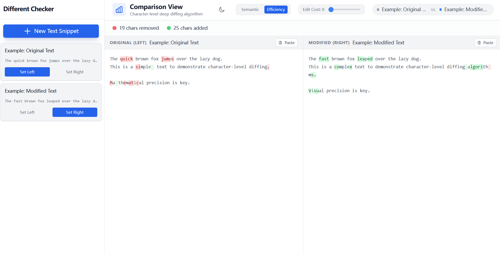
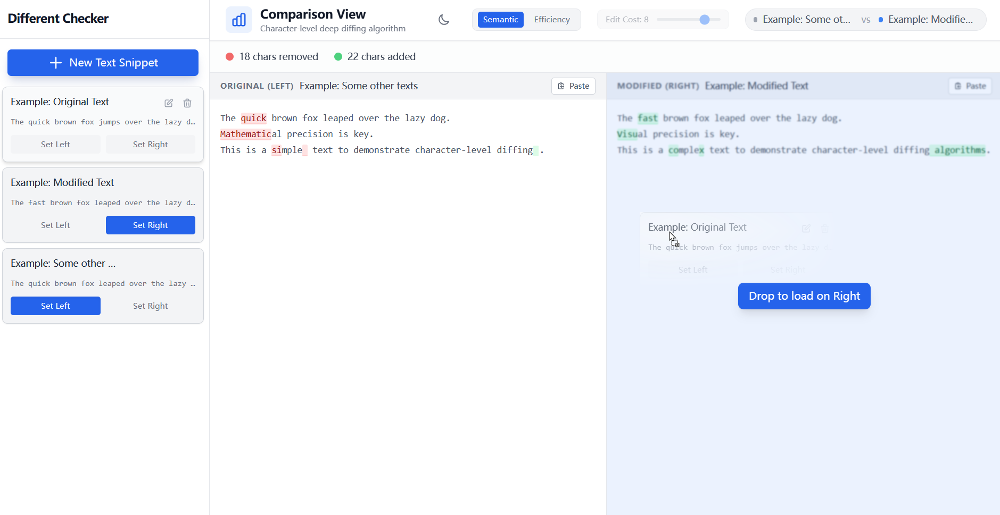

# 精准文本比较器 (Diff-Checker)

一个 **高性能、可视化的差异对比工具**，用于比较代码片段、文本文件或任意字符串数据。它能够直观地高亮插入、删除和修改内容。


## 📸 截图

> 请将下面的占位图替换为实际的截图。






## ✨ 功能特性

- **可自定义差异算法** – 支持语义模式和效率模式切换。
- **明暗主题** – 自动检测系统主题，也可手动切换。
- **可调编辑成本** – 微调对变化的敏感度。
- **实时编辑** – *即将推出*。
- **多片段支持** – 可以创建任意数量的文本片段，并自由选择任意两段进行比较。


## 🚀 快速开始

### 前置条件

- Node.js (>= 18)
- npm (>= 9)

### 安装步骤

```bash
# 克隆仓库
git clone https://github.com/yourusername/precision-diff-checker.git

# 进入项目目录
cd precision-diff-checker

# 安装依赖
npm install
```

### 启动开发服务器

```bash
npm run dev
```

在浏览器打开 `http://localhost:3000` 即可查看应用。


## 📖 使用指南

1. **创建片段** – 点击 “新建片段” 按钮，添加任意数量的文本片段。
2. **选择对比** – 从列表中任选两段片段进行比较。
3. **调整设置**（主题、编辑成本、清理模式）通过工具栏完成。
4. **查看差异** – 当编辑片段内容时，差异会即时更新。


## 📄 许可证

本项目采用 **MIT 许可证**，详情请参阅 [LICENSE](./LICENSE)。

## 📧 联系方式

如有疑问或反馈，请提交 Issue 或联系我 `wuyijun21@mails.ucas.ac.cn`。
