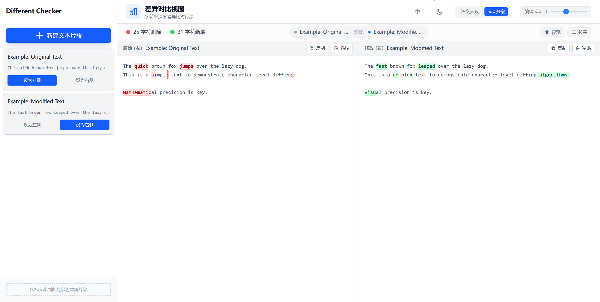

# 精准文本比较器 (Diff-Checker)

一个 **高性能、可视化的差异对比工具**，用于比较代码片段、文本文件或任意字符串数据。它能够直观地高亮插入、删除和修改内容。


## 📸 截图




## ✨ 功能特性

- **可自定义差异算法** – 支持语义模式和效率模式切换。
- **明暗主题** – 自动检测系统主题，也可手动切换。
- **可调编辑成本** – 微调对变化的敏感度。
- **实时编辑** – 及时响应的差异计算, 采用了高效的任务调度机制, 拒绝卡顿。
- **多片段支持** – 可以创建任意数量的文本片段，并自由选择任意两段进行比较。
- **增强的拖放功能** – 可将文本拖放到侧边栏的任意位置或直接拖到左右面板创建片段。
- **智能片段命名** – 根据创建方式自动命名，并附带递增编号：
  - **未命名文本** (通过"新建片段"按钮创建)
  - **拖拽文本** (通过拖放文本创建)
  - **粘贴文本** (通过粘贴创建)
- **双语界面** – 完整支持中英文切换。
- **灵活的内容管理**:
  - 可在空面板上粘贴以创建新片段
  - 使用 Ctrl+C 复制面板内容
  - 使用 Ctrl+V 或粘贴按钮向面板粘贴内容
  - 所有拖放操作都有视觉反馈


## 🚀 快速开始

### 前置条件

- Node.js (>= 18)
- npm (>= 9)

### 安装步骤

```bash
# 克隆仓库
git clone https://github.com/yourusername/precision-diff-checker.git

# 进入项目目录
cd precision-diff-checker

# 安装依赖
npm install
```

### 启动开发服务器

```bash
npm run dev
```

在浏览器打开 `http://localhost:3000` 即可查看应用。


## 📖 使用指南

### 创建代码片段

创建代码片段有多种方法：

1. **使用“新建代码片段”按钮** – 点击此按钮打开编辑器，从头开始创建代码片段。
2. **拖放文本** – 将文本拖放到侧边栏（列表区域的任意位置）或直接拖放到左侧/右侧面板。
3. **粘贴文本** – 在空白面板上点击“粘贴”按钮，或选择一个面板并按下 Ctrl+V。

每种方法都会自动分配一个唯一的编号名称，以便于识别。

### 比较代码片段

1. **选择代码片段** – 点击任意代码片段上的“设置为左侧”或“设置为右侧”按钮，或将它们拖放到面板中。
2. **调整设置** – 使用工具栏切换以下选项：
    - **浅色/深色主题**
    - **语言**（英语/中文）
    - **清理模式**（语义/效率）
    - **编辑成本**（0-10）
3. **查看差异** – 更改会实时高亮显示：
    - 🔴 红色 = 删除（左侧面板）
    - 🟢 绿色 = 插入（右侧面板）
4. **实时编辑** – 切换“编辑模式”以修改内容，并实时查看差异更新。

## 📄 许可证

本项目采用 **MIT 许可证**，详情请参阅 [LICENSE](./LICENSE)。

## 📧 联系方式

如有疑问或反馈，请提交 Issue 或联系我 `wuyijun21@mails.ucas.ac.cn`。
